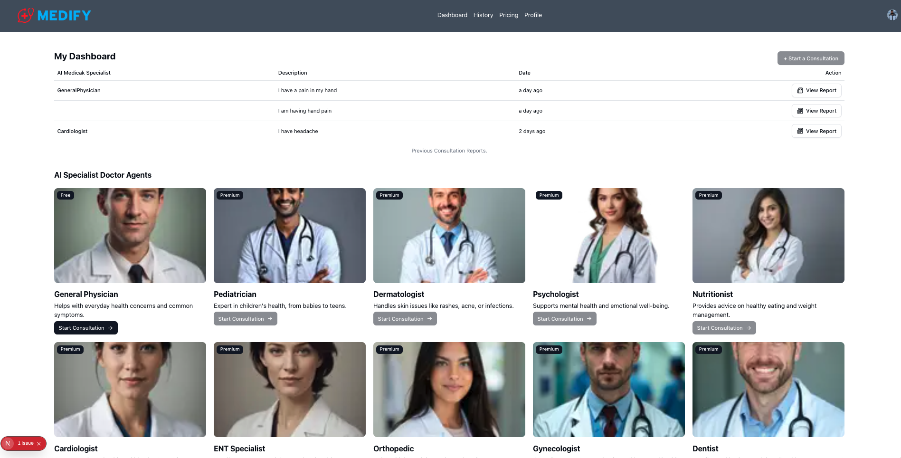

# Medify

Medify is an AI-powered medical consultation web application that allows users to consult AI doctor agents via voice, upload and analyze medical records, and receive structured medical reports — all within a secure, authenticated dashboard.



---

## Features

- **AI Doctor Consultations** — Conduct real-time voice-based medical consultations with AI doctor agents powered by Vapi and OpenAI. Each session is logged and stored.
- **Medical Records Upload** — Upload medical documents (PDFs, images) which are parsed via OCR (Tesseract.js) and PDF extraction, then automatically summarized by AI.
- **AI-Generated Summaries** — Every uploaded record gets an AI-generated structured summary, viewable in a rich markdown dialog and exportable as a PDF.
- **Consultation History** — Browse and revisit past consultation sessions, including full conversation transcripts and generated reports.
- **Doctor Suggestions** — Get AI-powered specialist doctor suggestions based on consultation notes.
- **Credit System** — Users are allocated credits to manage consultation usage.
- **Authentication** — Secure sign-up and sign-in via Clerk with middleware-protected routes.
- **Dark Mode** — Full light/dark theme support via `next-themes`.
- **Public Marketing Pages** — Dedicated `/about`, `/features`, and `/contact` pages with animated sections, team profiles, feature breakdowns, a contact form, and an FAQ accordion.
- **Persistent Footer** — Site-wide footer with navigation links to Company, Legal, and Product sections.

---

## Tech Stack

| Layer | Technology |
|---|---|
| Framework | [Next.js 15](https://nextjs.org/) (App Router) |
| Language | TypeScript |
| Styling | Tailwind CSS v4 |
| Auth | [Clerk](https://clerk.com/) |
| Database | [Neon](https://neon.tech/) (PostgreSQL, serverless) |
| ORM | [Drizzle ORM](https://orm.drizzle.team/) |
| AI (LLM) | [OpenAI](https://platform.openai.com/) GPT models |
| Voice AI | [Vapi](https://vapi.ai/) |
| File Storage | [Cloudinary](https://cloudinary.com/) |
| OCR | [Tesseract.js](https://tesseract.projectnaptha.com/) |
| PDF Parsing | [pdf-parse](https://www.npmjs.com/package/pdf-parse) |
| PDF Export | [jsPDF](https://github.com/parallax/jsPDF) |
| UI Components | [Radix UI](https://www.radix-ui.com/), [Lucide React](https://lucide.dev/), [Tabler Icons](https://tabler.io/icons) |
| Animations | [Motion](https://motion.dev/) |
| Notifications | [Sonner](https://sonner.emilkowal.ski/) |

---

## Project Structure

```
medify/
├── app/
│   ├── (auth)/                  # Sign-in and sign-up pages (Clerk)
│   │   ├── sign-in/
│   │   └── sign-up/
│   ├── (routes)/
│   │   ├── about/               # About page (mission, values, team)
│   │   ├── features/            # Features page (feature grid, highlights, how-it-works)
│   │   ├── contact/             # Contact page (form, FAQ, contact details)
│   │   └── dashboard/
│   │       ├── _components/     # Shared dashboard UI components
│   │       ├── billing/         # Billing & credits page
│   │       ├── history/         # Consultation history page
│   │       ├── medical-agent/   # Live AI consultation session
│   │       ├── medical-records/ # Uploaded medical records page
│   │       └── page.tsx         # Dashboard home
│   ├── _components/             # Landing page sections (Hero, Features, Team, Footer)
│   ├── api/                     # Next.js API routes
│   │   ├── medical-records/     # CRUD for uploaded records
│   │   ├── medical-report/      # AI report generation
│   │   ├── session-chat/        # Consultation session management
│   │   ├── suggest-doctors/     # AI doctor suggestions
│   │   └── users/               # User management
│   ├── globals.css
│   ├── layout.tsx
│   └── page.tsx                 # Landing page
├── config/
│   ├── db.tsx                   # Drizzle + Neon database client
│   ├── OpenAiModel.tsx          # OpenAI client configuration
│   └── schema.tsx               # Database schema (users, sessions, records)
├── context/
│   └── UserDetailContext.tsx    # Global user context
├── lib/
│   ├── ocr.ts                   # Tesseract.js OCR extraction
│   ├── pdf-parser.ts            # PDF text extraction
│   └── utils.ts                 # Utility helpers
├── middleware.ts                 # Clerk auth middleware
├── drizzle.config.ts            # Drizzle Kit config
└── public/                      # Static assets
```

---

## Database Schema

```
users
├── id (PK)
├── name
├── email (unique)
└── credits

sessionChatTable
├── id (PK)
├── sessionId
├── notes
├── selectedDoctor (JSON)
├── conversation (JSON)
├── report (JSON)
├── createdBy → users.email
└── createdOn

medicalRecordsTable
├── id (PK)
├── fileName
├── fileUrl
├── fileType
├── fileSize
├── summary
├── originalContent
├── createdBy → users.email
└── createdOn
```

---

## Getting Started

### Prerequisites

- Node.js 18+
- A [Neon](https://neon.tech/) PostgreSQL database
- A [Clerk](https://clerk.com/) application
- A [Cloudinary](https://cloudinary.com/) account
- An [OpenAI](https://platform.openai.com/) API key
- A [Vapi](https://vapi.ai/) account

### Installation

```bash
git clone https://github.com/your-username/medify.git
cd medify
npm install
```

### Environment Variables

Create a `.env.local` file in the root with the following variables:

```env
# Clerk
NEXT_PUBLIC_CLERK_PUBLISHABLE_KEY=your_clerk_publishable_key
CLERK_SECRET_KEY=your_clerk_secret_key
NEXT_PUBLIC_CLERK_SIGN_IN_URL=/sign-in
NEXT_PUBLIC_CLERK_SIGN_UP_URL=/sign-up

# Neon Database
DATABASE_URL=your_neon_postgres_connection_string

# OpenAI
OPENAI_API_KEY=your_openai_api_key

# Cloudinary
NEXT_PUBLIC_CLOUDINARY_CLOUD_NAME=your_cloud_name
CLOUDINARY_API_KEY=your_cloudinary_api_key
CLOUDINARY_API_SECRET=your_cloudinary_api_secret

# Vapi
NEXT_PUBLIC_VAPI_API_KEY=your_vapi_api_key
```

### Database Setup

Push the schema to your Neon database using Drizzle Kit:

```bash
npx drizzle-kit push
```

### Running Locally

```bash
npm run dev
```

Open [http://localhost:3000](http://localhost:3000) in your browser.

### Build for Production

```bash
npm run build
npm run start
```

---

## Key Workflows

### Starting an AI Consultation
1. Sign in and navigate to the Dashboard.
2. Select an AI doctor from the available specialists.
3. Click **New Consultation** to start a voice session powered by Vapi.
4. After the session ends, an AI-generated medical report is saved automatically.

### Uploading Medical Records
1. Go to **Medical Records** in the dashboard sidebar.
2. Click **Upload** and select a PDF or image file.
3. The file is uploaded to Cloudinary, its text extracted via OCR or PDF parsing, and an AI summary is generated via OpenAI.
4. View the summary in the dialog or **Save as PDF** for offline use.

### Viewing History
1. Navigate to **History** to see all past consultation sessions.
2. Click on any session to review the full conversation and the generated medical report.

### Exploring Public Pages
- Visit `/about` to learn about Medify's mission, values, and team.
- Visit `/features` for a detailed breakdown of every platform capability with a "How it works" walkthrough.
- Visit `/contact` to send a message via the contact form, find office/email/phone details, or browse the FAQ accordion.

---

## Scripts

| Command | Description |
|---|---|
| `npm run dev` | Start development server |
| `npm run build` | Build for production |
| `npm run start` | Start production server |
| `npm run lint` | Run ESLint |

---

## License

This project is private and not licensed for public distribution.
